# Laporan Resmi Praktikum Modul 2 Jarkom

| No | Nama Anggota | NRP |
|---|---|---|
| 1. | Atik Putri Matulina | 5027251128 |
| 2. | Muhammad Syihan Zhafiri | 5027251052 |

> Prefix IP Kelompok: `10.70.x.x` (K-13) · Controller GNS3: `http://10.4.89.246` (Group A) · Image: `ardhptr21/debinet:latest`

## Soal 1

> Sebagai pusat kesadaran The Mesh, rootkit harus merentangkan koneksinya ke lima gerbang utama (Switch). Tetapkan alamat IP dan default gateway untuk seluruh Entitas, mulai dari para operator (alpha, beta, gamma), penjaga directory (prab, tedd), gerbang penyaring (abbey, penny), hingga repository (obladi, desmond, oblada, molly) sesuai dengan topologi pembagian switch yang dirancang. [GUNAKAN PREFIX IP MASING-MASING KELOMPOK]

---

### Konfigurasi

Topologi dibangun sesuai diagram referensi pada dokumen soal: router **rootkit** sebagai pusat (6 network adapter: eth0 untuk NAT/WAN, eth1-eth5 untuk lima segmen switch), ditambah 7 Ethernet switch dan 13 Entitas client/server (`ardhptr21/debinet:latest`). Switch2 dan Switch3 ber-cascade di bawah Switch1 sehingga zona resolusi (prab, tedd) dan repositori (obladi, desmond, oblada, molly) berada pada satu segmen L2 yang sama.

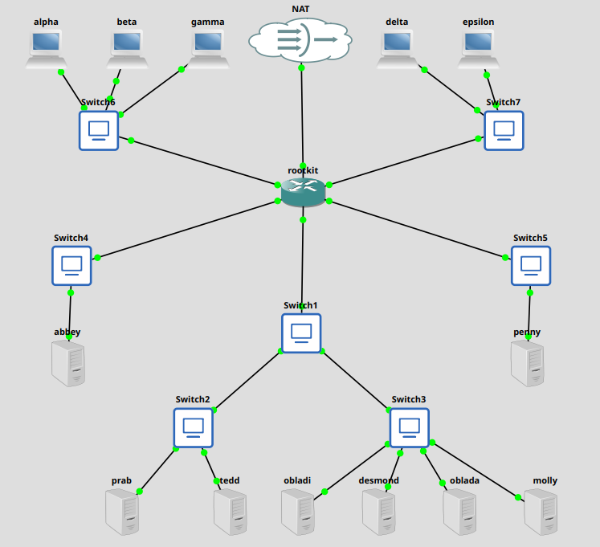

Pembagian subnet menggunakan prefix kelompok K-13 yaitu `10.70.x.x` dengan satu /24 per segmen switch:

| Subnet | Switch | Node | Interface | IP Address | Gateway |
|---|---|---|---|---|---|
| 10.70.1.0/24 | Switch1 | rootkit | eth1 | 10.70.1.1/24 | - |
| | (via Switch2) | prab | eth0 | 10.70.1.2/24 | 10.70.1.1 |
| | | tedd | eth0 | 10.70.1.3/24 | 10.70.1.1 |
| | (via Switch3) | obladi | eth0 | 10.70.1.4/24 | 10.70.1.1 |
| | | desmond | eth0 | 10.70.1.5/24 | 10.70.1.1 |
| | | oblada | eth0 | 10.70.1.6/24 | 10.70.1.1 |
| | | molly | eth0 | 10.70.1.7/24 | 10.70.1.1 |
| 10.70.2.0/24 | Switch6 | rootkit | eth2 | 10.70.2.1/24 | - |
| | | alpha | eth0 | 10.70.2.2/24 | 10.70.2.1 |
| | | beta | eth0 | 10.70.2.3/24 | 10.70.2.1 |
| | | gamma | eth0 | 10.70.2.4/24 | 10.70.2.1 |
| 10.70.3.0/24 | Switch7 | rootkit | eth3 | 10.70.3.1/24 | - |
| | | delta | eth0 | 10.70.3.2/24 | 10.70.3.1 |
| | | epsilon | eth0 | 10.70.3.3/24 | 10.70.3.1 |
| 10.70.4.0/24 | Switch4 | rootkit | eth4 | 10.70.4.1/24 | - |
| | | abbey | eth0 | 10.70.4.2/24 | 10.70.4.1 |
| 10.70.5.0/24 | Switch5 | rootkit | eth5 | 10.70.5.1/24 | - |
| | | penny | eth0 | 10.70.5.2/24 | 10.70.5.1 |

(Kolom interface rootkit eth0 untuk WAN/NAT baru dikonfigurasi pada Soal 2.)

Konfigurasi IP statis setiap node ditulis pada `/etc/network/interfaces` - contoh pada rootkit (eth1-eth5 sebagai gateway lima segmen):
```
auto eth1
iface eth1 inet static
    address 10.70.1.1
    netmask 255.255.255.0
auto eth2
iface eth2 inet static
    address 10.70.2.1
    netmask 255.255.255.0
auto eth3
iface eth3 inet static
    address 10.70.3.1
    netmask 255.255.255.0
auto eth4
iface eth4 inet static
    address 10.70.4.1
    netmask 255.255.255.0
auto eth5
iface eth5 inet static
    address 10.70.5.1
    netmask 255.255.255.0
```
dan contoh pada Entitas prab (pola sama untuk seluruh Entitas, disesuaikan IP/gatewaynya):
```
auto eth0
iface eth0 inet static
    address 10.70.1.2
    netmask 255.255.255.0
    gateway 10.70.1.1
```

Karena image `debinet` tidak menyediakan `ifup`/`ifdown`, alamat IP diterapkan secara live menggunakan perintah `ip` (`ip addr replace`, `ip route replace default`) yang bersifat idempotent aman untuk dijalankan ulang. Seluruh konfigurasi ini dibungkus dalam script init per-node (`/root/init.sh`) yang otomatis dieksekusi image debinet pada setiap boot melalui `/etc/debinet-init.sh`, sehingga konfigurasi bertahan saat node di-restart:

```
#!/bin/sh
...
[ -f /root/init.sh ] && [ -x /root/init.sh ] && /root/init.sh
...
```

Snippet `/root/init.sh` bagian yang dikerjakan sejak Soal 1 - contoh pada Entitas alpha (pola sama untuk seluruh node, disesuaikan IP/gateway/hostname-nya):

```sh
# 1. hostname
echo "alpha" > /etc/hostname && chmod 644 /etc/hostname && hostname "alpha"
CURRENT_HOST="$(hostname)"
log "hostname: $CURRENT_HOST"

# 2. /etc/network/interfaces
cat > /etc/network/interfaces <<'EOF'
# eth0 - segment 2 (gw 10.70.2.1)
auto eth0
iface eth0 inet static
    address 10.70.2.2
    netmask 255.255.255.0
    gateway 10.70.2.1
EOF

# 4. alamat IP
ip link set eth0 up
ip addr replace 10.70.2.2/24 dev eth0
ip route replace default via 10.70.2.1
```

Setiap hostname juga ditetapkan agar setiap host mengenali identitasnya secara system-wide (contoh verifikasi kartu hostname pada verifikasi di bawah).

### Verifikasi

Setiap node diperiksa alamat IP-nya sesuai tabel di atas. Contoh `ip -br a` pada rootkit - kelima gateway segmen terpasang (eth0 = NAT, dikonfigurasi pada Soal 2):

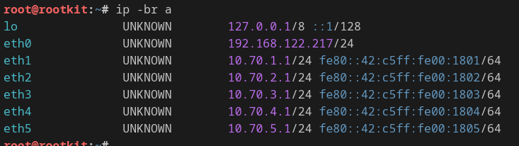

Contoh pada Entitas prab (10.70.1.2/24, default gateway 10.70.1.1):

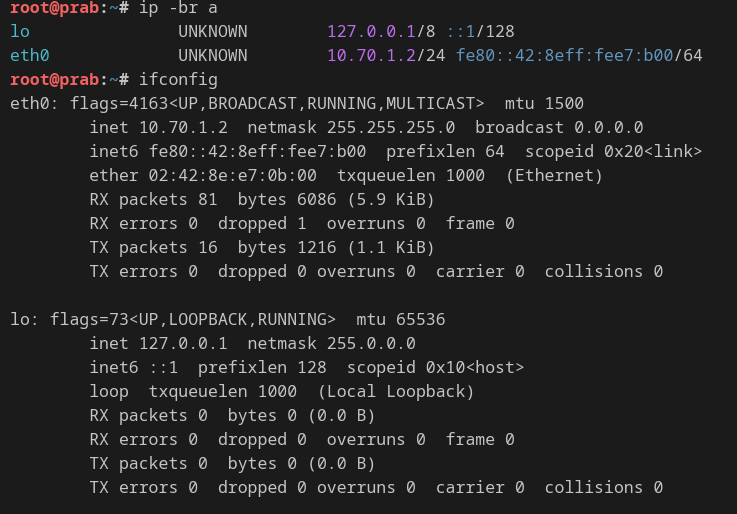

Gateway masing-masing segmen menguji keterjangkauan dari Entitas-nya (contoh prab dan alpha):

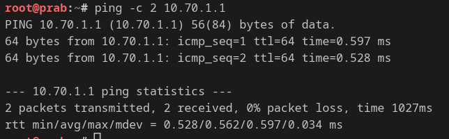

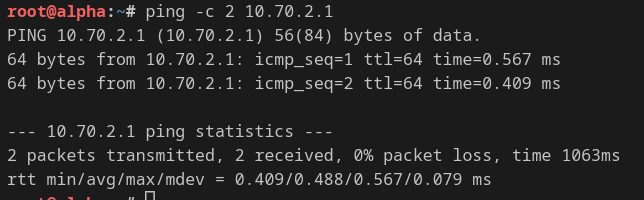

Kami juga membuat script verifikasi otomatis yang terhubung ke konsol telnet setiap node melalui GNS3 API untuk memeriksa IP, default route, dan ping gateway pada seluruh 15 node sekaligus (kode lengkap pada `assets/verify_soal1.py`). Hasilnya seluruh node PASS:

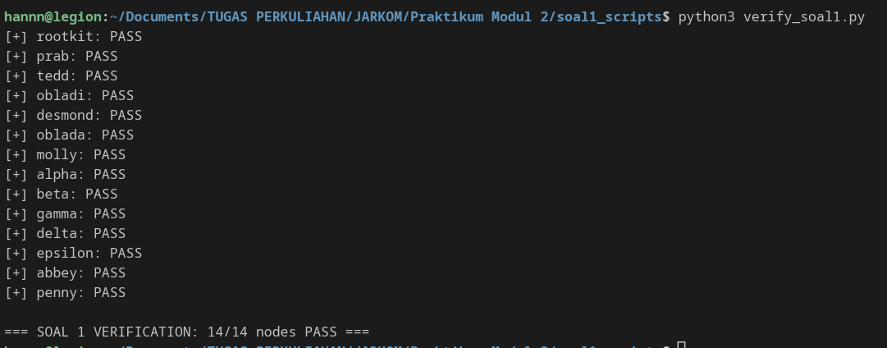

## Soal 2

> Meskipun The Mesh beroperasi dalam bayang-bayang, Rootkit menyadari bahwa Entitas di dalamnya masih membutuhkan asupan paket dari dunia luar. Buka jalur menuju NAT dengan memastikan antarmuka WAN di router rootkit aktif. Konfigurasikan NAT agar dapat meneruskan lalu lintas keluar bagi seluruh alamat internal, sehingga semua host di dalam jaringan dapat menjangkau internet publik menggunakan IP address.

---

### Konfigurasi

Antarmuka WAN rootkit (eth0) sudah aktif sejak Soal 1 - meminta alamat secara dinamis (DHCP) dari node NAT GNS3 (`iface eth0 inet dhcp`), sehingga rootkit berada pada jaringan 192.168.122.0/24 milik NAT. Agar seluruh alamat internal (10.70.x.x) dapat menjangkau internet publik, blok NAT ditambahkan pada segmen berikut `init_rootkit.sh` (`/root/init.sh` di node rootkit) sehingga aktif otomatis saat boot maupun saat script dijalankan ulang:

```sh
# 4. NAT (soal 2)
sysctl -w net.ipv4.ip_forward=1 >/dev/null
iptables -t nat -C POSTROUTING -o eth0 -j MASQUERADE 2>/dev/null \
  || iptables -t nat -A POSTROUTING -o eth0 -j MASQUERADE
for I in eth1 eth2 eth3 eth4 eth5; do
  iptables -C FORWARD -i $I -o eth0 -j ACCEPT 2>/dev/null \
    || iptables -A FORWARD -i $I -o eth0 -j ACCEPT
done
iptables -C FORWARD -i eth0 -m state --state ESTABLISHED,RELATED -j ACCEPT 2>/dev/null \
  || iptables -A FORWARD -i eth0 -m state --state ESTABLISHED,RELATED -j ACCEPT
```

Penjelasan tiap rule:
- `sysctl -w net.ipv4.ip_forward=1` - mengizinkan kernel rootkit meneruskan paket antar-interface (L2/L3 gateway untuk kelima segmen).
- `iptables -t nat -A POSTROUTING -o eth0 -j MASQUERADE` - menyamarkan source IP internal (10.70.x.x) menjadi IP DHCP eth0 (192.168.122.x) saat paket keluar ke internet, sehingga balasan internet tahu harus kembali ke rootkit.
- `iptables -A FORWARD -i eth1..eth5 -o eth0 -j ACCEPT` - mengizinkan trafik keluar dari kelima segmen LAN menuju WAN.
- `iptables -A FORWARD -i eth0 -m state --state ESTABLISHED,RELATED -j ACCEPT` - mengizinkan paket balasan dari internet masuk kembali, hanya untuk koneksi yang dibangun dari dalam.

Setiap rule dipasang dengan guard `iptables -C` (cek dulu, tambah bila belum ada) sehingga script tetap idempotent. rules dijalankan pada bagian NAT init_rootkit.sh:

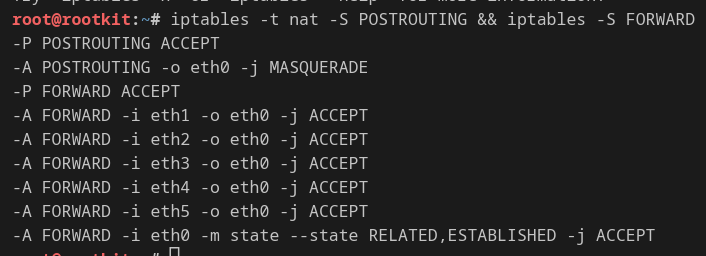

### Verifikasi

Dari console Entitas di segmen berbeda, dilakukan pengujian `ping 8.8.8.8` (internet publik via IP, sesuai soal). Berikut hasil dari prab (10.70.1.2, zona resolusi via Switch1-cascade):

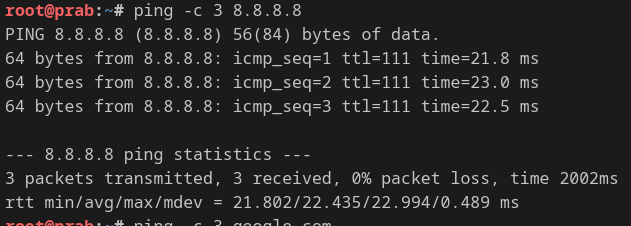

Dan dari alpha (10.70.2.2, sayap kiri via Switch6):

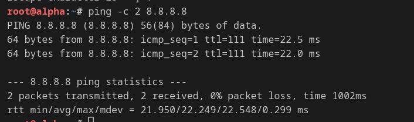

Verifikasi otomatis (kode lengkap pada `assets/verify_soal2.py`) memeriksa status `ip_forward`, rule MASQUERADE/FORWARD pada rootkit, dan ping 8.8.8.8 dari dua segmen:

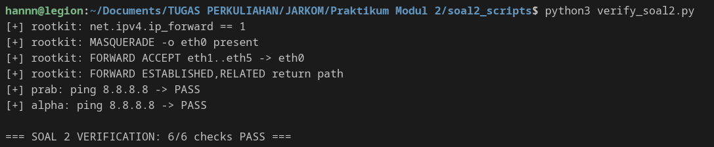

## Soal 3

> Jaringan rahasia tidak akan berfungsi tanpa sinkronisasi antar divisi. Pastikan seluruh Entitas dapat saling terhubung dan berkomunikasi lintas jalur (routing internal via rootkit berfungsi). Untuk menghindari fragmentasi saat persiapan, pastikan setiap host non-router menambahkan resolver 192.168.122.1 (tambah di file /etc/resolv.conf, kalau sudah pakai resolver itu tidak perlu memasukkan resolver google) saat antarmukanya aktif agar akses untuk mengunduh paket instalasi dari internet tersedia sejak awal beroperasi.

---

### Konfigurasi

Routing internal tidak memerlukan konfigurasi tambahan: rootkit mengenal kelima subnet (10.70.1.0/24 hingga 10.70.5.0/24) sebagai directly-connected network pada eth1-eth5, dan setiap Entitas memakai IP rootkit di segmennya sebagai default gateway (Soal 1), sehingga paket lintas segmen otomatis diteruskan oleh rootkit.

Pada setiap host non-router (13 Entitas; rootkit dikecualikan karena berperan sebagai router), resolver awal `192.168.122.1` (DNS internal node NAT GNS3) ditulis ke `/etc/resolv.conf` melalui blok baru pada `init_<node>.sh`:

```sh
# 3. resolver (soal 3)
echo "nameserver 192.168.122.1" > /etc/resolv.conf
```

> Blok resolver di atas kemudian diperpanjang pada Soal 4 menjadi tiga baris
> (prab, tedd, lalu 192.168.122.1); itulah bentuk yang berlaku saat pengerjaan
> soal 3.

Karena `/root/init.sh` dijalankan otomatis oleh debinet pada setiap boot (lihat Soal 1), resolver ini aktif "saat antarmuka aktif" tepat seperti diminta soal - tersedia sejak awal beroperasi untuk mengunduh paket instalasi.

Contoh isi `/etc/resolv.conf` pada host prab:

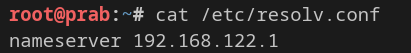

### Verifikasi

Pengujian routing lintas segmen dilakukan dari satu host per segmen ke segmen lainnya (prab/alpha/delta/abbey/penny) - contoh pengujian tenacity rute dari alpha ke segmen para penjaga direktori dan repositori:

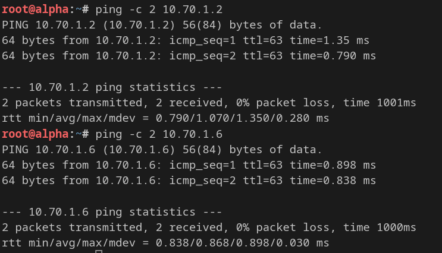

Setiap host non-router juga diuji mampu me-resolve dan menjangkau domain publik menggunakan resolver 192.168.122.1 (contoh pada tedd):

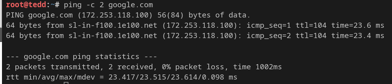

Verifikasi otomatis (kode lengkap pada `assets/verify_soal3.py`) menjalankan matriks ping lintas segmen (kombinasi 20) dan pemeriksaan resolver + resolusi `google.com` pada seluruh 13 host:

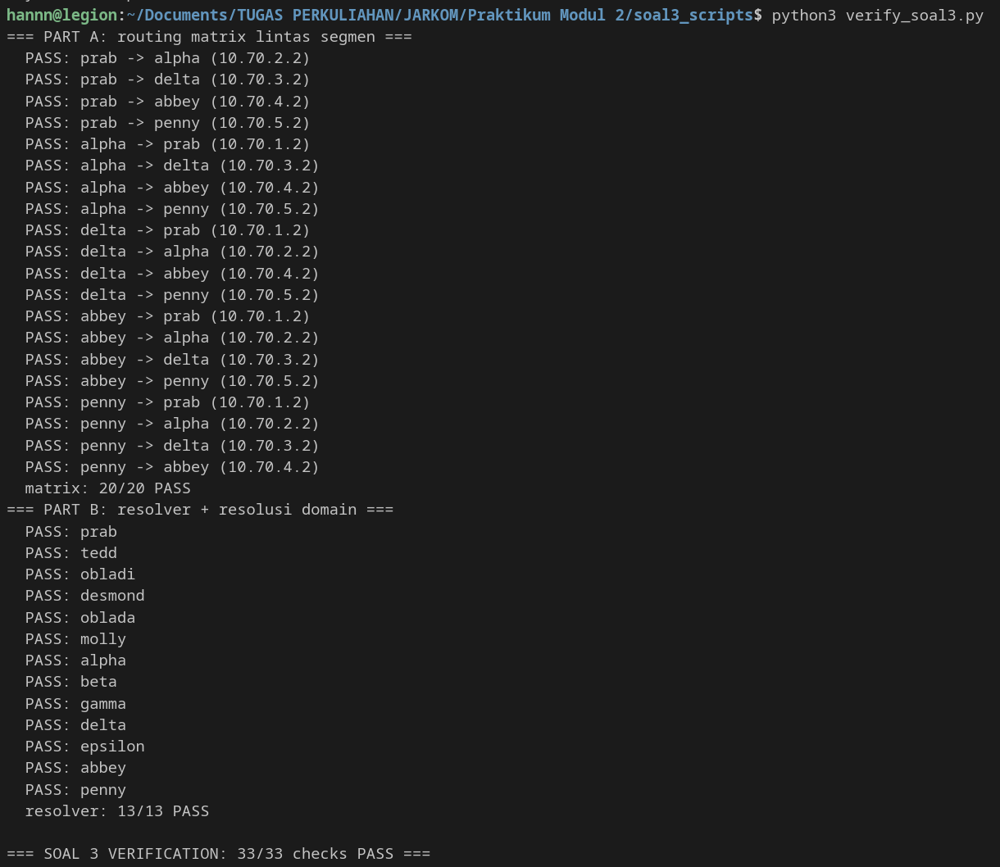

## Soal 4

> Penjaga Direktori mulai menuliskan hukum The Mesh. Pada node prab, bangun zona <xxxx>.com sebagai authoritative dengan SOA yang menunjuk ke prab.<xxxx>.com, serta tambahkan catatan NS untuk prab.<xxxx>.com dan tedd.<xxxx>.com. Buat A record untuk prab.<xxxx>.com dan tedd.<xxxx>.com yang mengarah ke alamat IP mereka masing-masing, serta A record apex <xxxx>.com yang mengarah ke gerbang aplikasi dinamis (penny). Aktifkan fitur notify dan allow-transfer ke tedd, lalu set forwarders ke 192.168.122.1. Di node tedd, tarik zona <xxxx>.com dari master dan pastikan server menjawab secara authoritative. Setelah fondasi nama ini berdiri kokoh, perbarui urutan resolver pada seluruh Entitas non-router menjadi: IP prab, IP tedd, lalu 192.168.122.1. Verifikasi bahwa query ke domain apex maupun hostname di dalam zona dijawab dengan benar oleh prab atau tedd.

---

### Konfigurasi

Nama kelompok K-13 dipakai sebagai domain internal: **`k13.com`**. Node prab dipasang BIND9 sebagai master (ns1) dan tedd sebagai slave (ns2) melalui `init_prab.sh` dan `init_tedd.sh` (paket diinstal idempotent, service `named` dijalankan ulang oleh script pada setiap boot).

Zona master pada `/etc/bind/db.k13.com` di prab - SOA menunjuk ke `prab.k13.com`, dua NS, A record prab/tedd, dan apex `k13.com` mengarah ke gerbang penny (10.70.5.2). Serial digenerate otomatis dari waktu saat script berjalan (`date +%y%m%d%H%M`, sepuluh digit agar muat rentang 32-bit serial BIND) agar setiap perubahan isi zona selalu menaikkan serial dan slave ikut menyegarkan:

```
$TTL 300
@   IN SOA prab.k13.com. admin.k13.com. (
        202609280000   ; serial
        3600 300 604800 300 )
    IN NS  prab.k13.com.
    IN NS  tedd.k13.com.
prab     IN A 10.70.1.2
tedd     IN A 10.70.1.3
@        IN A 10.70.5.2
```

Konfigurasi `named.conf` prab: zona bertipe master dengan `notify yes`, `also-notify`/`allow-transfer` ke tedd (10.70.1.3), dan `forwarders` ke 192.168.122.1 (DNS internal NAT GNS3) agar rekursi domain luar tetap berfungsi. `dnssec-validation no` dipakai agar resolusi via forwarder tidak SERVFAIL di dalam lab:

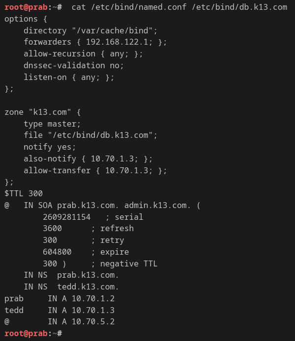

Di tedd, zona bertipe slave dengan `masters { 10.70.1.2; }`. Script init tedd menunggu sampai transfer zona berhasil (SOA serial terjawab) sebelum melaporkan diri siap, sehingga tedd menjawab query zona secara authoritative:

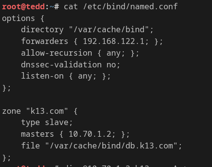

Setelah fondasi DNS hidup, urutan resolver pada seluruh host non-router diperbarui menjadi prab (10.70.1.2) → tedd (10.70.1.3) → 192.168.122.1 melalui blok resolver pada setiap `init_<node>.sh`:

```sh
cat > /etc/resolv.conf <<'EOF'
nameserver 10.70.1.2
nameserver 10.70.1.3
nameserver 192.168.122.1
EOF
```

Snippet pembungkus BIND di `init_prab.sh` - instalasi idempotent (menunggu internet bila container baru di-restart karena paket tidak persisten), penulisan konfigurasi/zona, lalu menjalankan `named` tanpa systemd. Serial zona digenerate dari waktu sehingga setiap perubahan isi zona otomatis menaikkan serial:

```sh
if ! command -v named >/dev/null 2>&1; then
    log "installing bind9 (menunggu koneksi internet untuk apt) ..."
    W=0
    until ping -c1 -W2 8.8.8.8 >/dev/null 2>&1 || [ $W -ge 24 ]; do
        sleep 5
        W=$((W+1))
    done
    apt-get update -qq
    DEBIAN_FRONTEND=noninteractive apt-get install -y -qq bind9 bind9-utils bind9-dnsutils
fi
SERIAL="$(date +%y%m%d%H%M)"
```

```sh
pkill named 2>/dev/null || true
mkdir -p /run/named && chown bind:bind /run/named
sleep 1
named -u bind
sleep 2
SER="$(dig @127.0.0.1 k13.com SOA +short 2>/dev/null | awk '{print $3}')"
log "bind9 master aktif - serial zona: ${SER:-TIDAK JALAN}"
```

Pada `init_tedd.sh` pola sama, ditambah loop tunggu transfer zona (SOA serial terjawab, maksimum 50 detik) sebelum melaporkan diri siap:

```sh
pkill named 2>/dev/null || true
rm -f /var/cache/bind/db.k13.com*
mkdir -p /run/named && chown bind:bind /run/named
named -u bind
N=0
while [ $N -lt 15 ]; do
    SER="$(dig @127.0.0.1 k13.com SOA +short 2>/dev/null | awk '{print $3}')"
    [ -n "$SER" ] && break
    N=$((N+1))
    sleep 2
done
```

### Verifikasi

Query langsung ke prab - apex, A record hostname, NS, dan flag `aa` (authoritative answer):

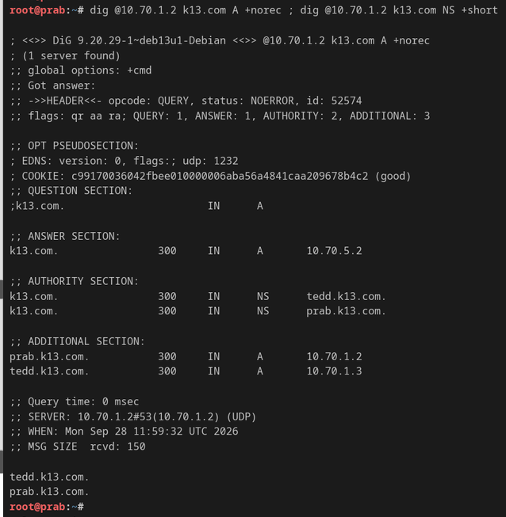

Query ke tedd - zona hasil transfer dijawab authoritative dengan serial SOA yang sama dengan prab:

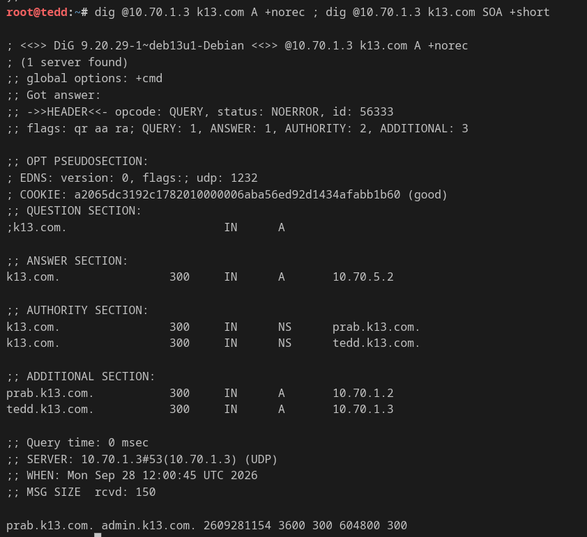

Resolusi dari sisi host (alpha) menggunakan urutan resolver baru - `getent hosts k13.com` terjawab oleh prab:

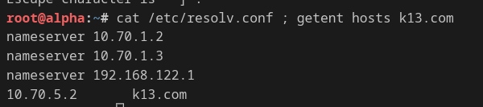

Verifikasi otomatis (kode lengkap pada `assets/verify_soal4.py`) memeriksa seluruh record, flag aa di kedua server, kesamaan serial prab-tedd, forwarders, dan urutan resolv.conf pada 13 host:

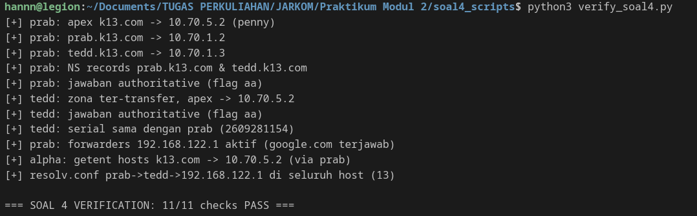

## Soal 5

> "Entitas tanpa identitas adalah anomali," pesan Rootkit. Namai semua Entitas (hostname) sesuai glosarium: rootkit, alpha, beta, gamma, delta, epsilon, prab, tedd, abbey, penny, obladi, desmond, oblada, molly, dan verifikasi bahwa setiap host mengenali hostname tersebut secara system-wide. Buat setiap domain untuk masing-masing node sesuai dengan namanya (contoh: alpha.<xxxx>.com) dan assign IP masing-masing juga. Lakukan pengecualian untuk node yang bertanggung jawab atas prab dan tedd.

---

### Konfigurasi

Penamaan hostname sudah diberlakukan sejak Soal 1 melalui bagian hostname tiap `init_<node>.sh` (ditulis ke `/etc/hostname` dan `hostname` dijalankan), sehingga setiap node mengenali hostname-nya secara system-wide (`hostname` dan `cat /etc/hostname` mengembalikan nama yang sama).

Domain per-node ditambahkan pada zona `k13.com` di `/etc/bind/db.k13.com` (prab) - 12 A record untuk rootkit, klien sayap kiri/kanan, gerbang, dan repositori. Pengecualian untuk prab dan tedd: A record keduanya sudah dibuat pada Soal 4, sehingga tidak diduplikasi:

```
rootkit  IN A 10.70.1.1
alpha    IN A 10.70.2.2
beta     IN A 10.70.2.3
gamma    IN A 10.70.2.4
delta    IN A 10.70.3.2
epsilon  IN A 10.70.3.3
abbey    IN A 10.70.4.2
penny    IN A 10.70.5.2
obladi   IN A 10.70.1.4
desmond  IN A 10.70.1.5
oblada   IN A 10.70.1.6
molly    IN A 10.70.1.7
```

Karena serial SOA digenerate otomatis dari waktu setiap script berjalan, penambahan record ini otomatis menaikkan serial sehingga notify menyebar dan tedd ikut menarik salinan zona yang baru berisi seluruh domain per-node.

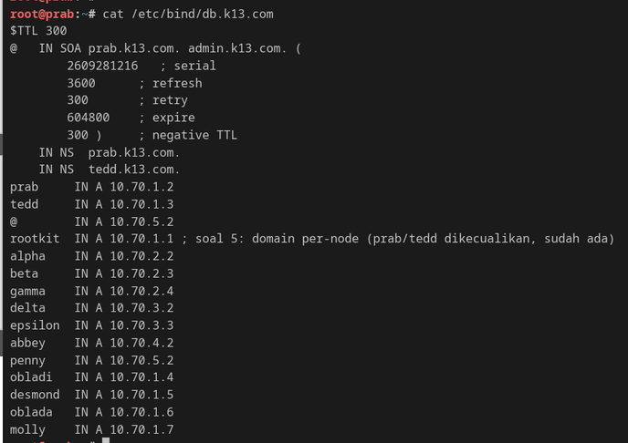

### Verifikasi

Hostname system-wide dicek di setiap node (`hostname` = `cat /etc/hostname` = nama node, contoh pada delta dan desmond):

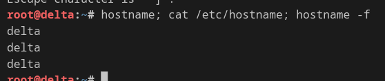

Query domain per-node dijawab identik oleh master (prab) maupun slave (tedd) - contoh alpha.k13.com dan rootkit.k13.com:

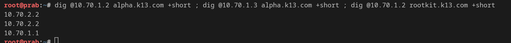

Resolusi dari sisi host melalui resolver lokal (contoh delta → oblada.k13.com, alpha → rootkit.k13.com):

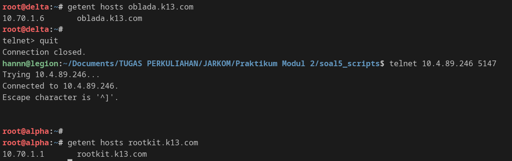

Verifikasi otomatis (kode lengkap pada `assets/verify_soal5.py`) memeriksa hostname 14 node, seluruh 12 domain per-node pada kedua server, dan resolusi sisi host:

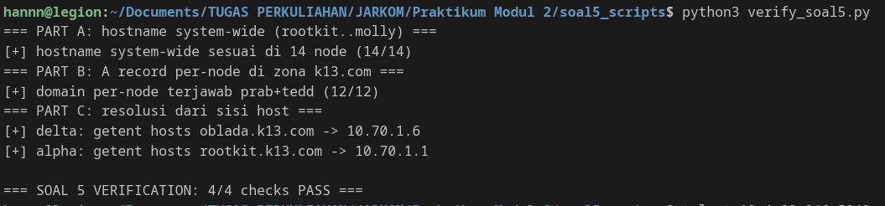

## Soal 6

> Pastikan zone transfer berjalan, pastikan tedd telah menerima salinan zona terbaru dari prab. Nilai serial SOA di keduanya harus sama karena keduanya tidak bisa dipisahkan dan saling melengkapi.

---

### Konfigurasi

Tidak ada konfigurasi tambahan - mekanisme transfer dibangun pada Soal 4 (`notify yes`, `also-notify { 10.70.1.3; }`, `allow-transfer { 10.70.1.3; }` di prab; `type slave; masters { 10.70.1.2; }` di tedd) dan telah terbukti hidup selama pengerjaan: setiap kali isi zona berubah (penambahan 12 domain per-node pada Soal 5), serial SOA di prab otomatis naik (`2609281153` → `2609281154` → `2609281216`) dan tedd selalu mengambil salinan baru hingga serialnya kembali sama.

Serial SOA keduanya terbaca identik pada saat verifikasi:

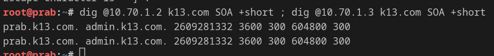

### Verifikasi

Bukti transfer yang hidup: query **AXFR** (full zone transfer) dari console tedd ke prab dibolehkan - tedd dapat menarik seluruh isi zona kapan pun karena berada di daftar `allow-transfer`:

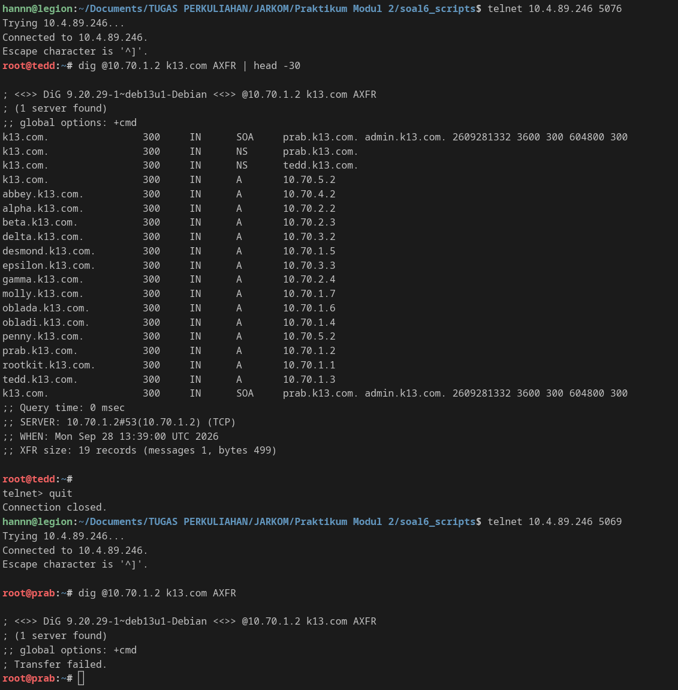

Sebaliknya, AXFR dari pihak lain (contoh: console prab sendiri, dengan source IP selain 10.70.1.3) **ditolak (REFUSED)** - membuktikan allow-transfer terpasang dan hanya tedd yang boleh menarik zona. Salinan hasil transfer juga tersimpan di `/var/cache/bind/db.k13.com` pada tedd.

Keduanya menjawab secara authoritative (flag `aa`) untuk zona yang sama, dan verifikasi otomatis (kode lengkap pada `assets/verify_soal6.py`) menuntaskan pemeriksaan: kesamaan serial, flag aa, AXFR diperbolehkan/lalu ditolak sesuai letak, keberadaan file zona di tedd, serta parity seluruh 15 A record yang dijawab identik oleh master dan slave:

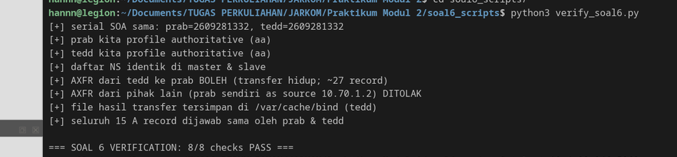

## Soal 7

> abbey dan penny sebagai gerbang utama, obladi dan desmond sebagai web statis, oblada dan molly sebagai web dinamis. Tambahkan pada zona <xxxx>.com A record untuk vault.<xxxx>.com (IP obladi & desmond), dan core.<xxxx>.com (IP oblada & molly). Tetapkan CNAME: www.<xxxx>.com → penny.<xxxx>.com, static.<xxxx>.com → abbey.<xxxx>.com. Verifikasi dari dua klien berbeda bahwa seluruh hostname tersebut ter-resolve ke tujuan yang benar dan konsisten.

---

### Konfigurasi

Empat record baru ditambahkan pada zona `k13.com` di `/etc/bind/db.k13.com` (prab). `vault` dan `core` memakai **dua A record** masing-masing (round-robin DNS) - satu IP untuk setiap node di area-nya - sedangkan `www` dan `static` adalah CNAME yang menunjuk ke domain gerbang yang sudah dibuat pada Soal 5:

```
vault    IN A 10.70.1.4 ; round-robin area vault
vault    IN A 10.70.1.5
core     IN A 10.70.1.6 ; round-robin area core
core     IN A 10.70.1.7
www      IN CNAME penny.k13.com.
static   IN CNAME abbey.k13.com.
```

Serial SOA otomatis naik setiap script dijalankan, sehingga tedd kembali menarik salinan zona terbaru.

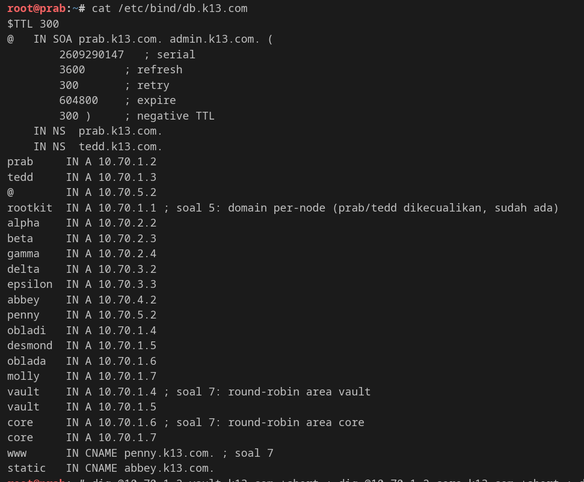

### Verifikasi

Query ke kedua server menunjukkan round-robin A record (`vault` mengembalikan dua IP, `core` dua IP) dan CNAME menunjuk tepat:

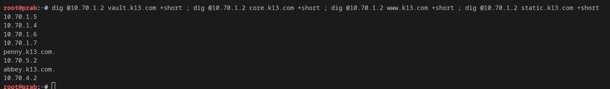

Verifikasi dari dua klien berbeda (alpha, segmen sayap kiri dan delta, segmen sayap kanan) menggunakan `getent ahostsv4` - seluruh jawaban kedua klien konsisten:

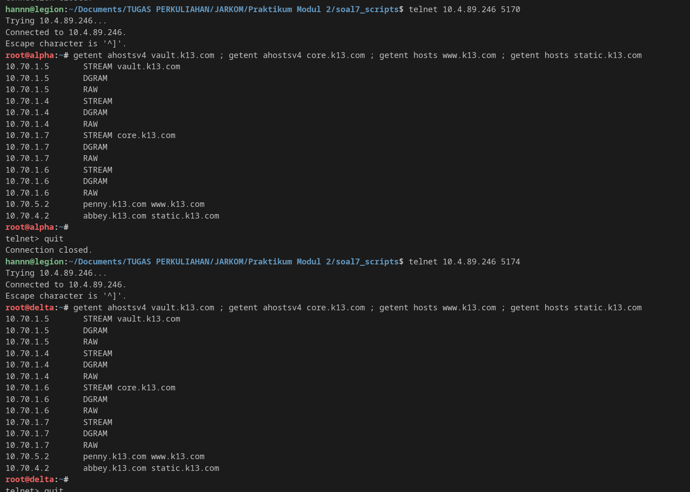

Verifikasi otomatis (kode lengkap pada `assets/verify_soal7.py`) memeriksa keempat nama pada kedua server dan konsistensi jawaban dua klien:

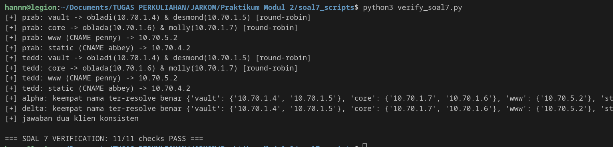

## Soal 8

> Di prab (ns1) deklarasikan reverse zone untuk segmen jaringan tempat abbey, penny, area vault, dan area core berada. Di tedd (ns2) tarik reverse zone tersebut sebagai slave, isi PTR untuk keempat hostname itu agar pencarian balik IP address mengembalikan hostname yang benar, lalu pastikan query reverse untuk alamat abbey, penny, area vault, dan area core dijawab authoritative.

---

### Konfigurasi

Sesuai konfirmasi asisten, alamat abbey, penny, area vault, dan area core berada pada **tiga segmen subnet berbeda**, sehingga di prab dideklarasikan **tiga reverse zone** - `1.70.10.in-addr.arpa` (segmen repositori), `4.70.10.in-addr.arpa` (gerbang abbey), dan `5.70.10.in-addr.arpa` (gerbang penny). Ketiganya bertipe master dengan `notify` + `allow-transfer` ke tedd, dan di tedd ketiganya ditarik sebagai slave. Snippet `named.conf` pada `init_prab.sh` (bagian reverse zone / soal 8):

```sh
zone "1.70.10.in-addr.arpa" {
    type master;
    file "/etc/bind/db.1.70.10";
    notify yes;
    also-notify { 10.70.1.3; };
    allow-transfer { 10.70.1.3; };
};
zone "4.70.10.in-addr.arpa" {
    type master;
    file "/etc/bind/db.4.70.10";
    notify yes;
    also-notify { 10.70.1.3; };
    allow-transfer { 10.70.1.3; };
};
zone "5.70.10.in-addr.arpa" {
    type master;
    file "/etc/bind/db.5.70.10";
    notify yes;
    also-notify { 10.70.1.3; };
    allow-transfer { 10.70.1.3; };
};
```

Snippet penulisan file PTR pertama pada `init_prab.sh` (dua file lain pola sama):

```sh
# 6. reverse zone (soal 8)
cat > /etc/bind/db.1.70.10 <<ZONE
$TTL 300
@   IN SOA prab.k13.com. admin.k13.com. (
        $SERIAL
        3600 300 604800 300 )
    IN NS  prab.k13.com.
    IN NS  tedd.k13.com.
4     IN PTR vault.k13.com.
5     IN PTR vault.k13.com.
6     IN PTR core.k13.com.
7     IN PTR core.k13.com.
ZONE
```

Dan di `init_tedd.sh` - ketiga zona reverse ditarik sebagai slave, dengan loop tunggu yang menuntut KEEMPAT zona (forward + 3 reverse) terjawab sebelum laporan siap:

```sh
zone "1.70.10.in-addr.arpa" {
    type slave;
    masters { 10.70.1.2; };
    file "/var/cache/bind/db.1.70.10";
};
...
for ZN in k13.com 1.70.10.in-addr.arpa 4.70.10.in-addr.arpa 5.70.10.in-addr.arpa; do
    SER="$(dig @127.0.0.1 "$ZN" SOA +short 2>/dev/null | awk '{print $3}')"
    if [ -z "$SER" ]; then
        UP=0
    fi
done
```

PTR diisi untuk empat nama layanan sesuai soal - kedua IP area vault mengarah ke `vault.<xxxx>.com`, kedua IP area core ke `core.<xxxx>.com`, sedangkan IP abbey dan penny masing-masing ke domain node-nya:

| IP | PTR |
|---|---|
| 10.70.1.4, 10.70.1.5 (obladi, desmond) | `vault.k13.com` |
| 10.70.1.6, 10.70.1.7 (oblada, molly) | `core.k13.com` |
| 10.70.4.2 (abbey) | `abbey.k13.com` |
| 10.70.5.2 (penny) | `penny.k13.com` |

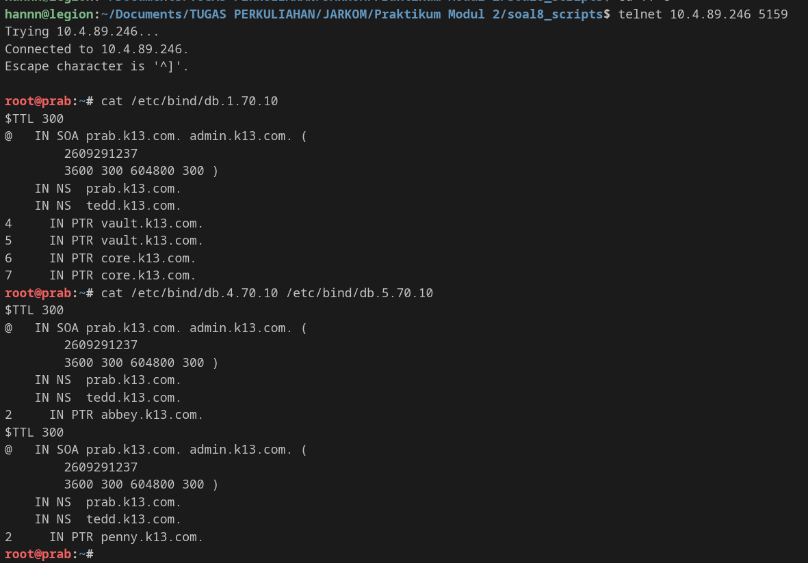

### Verifikasi

Query reverse (`dig -x`) pada kedua server mengembalikan nama yang benar dengan flag `aa` - contoh pencarian balik alamat area vault:

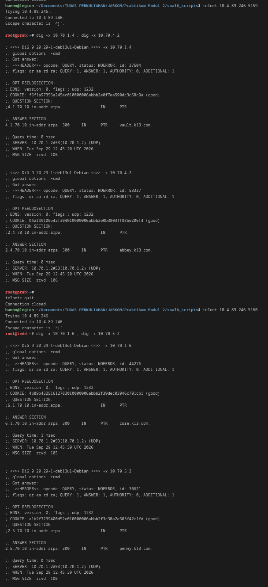

Verifikasi otomatis (kode lengkap pada `assets/verify_soal8.py`) memeriksa seluruh 6 PTR pada master dan slave, flag `aa` per zona, dan kelengkapan NS record ketiga reverse zone:

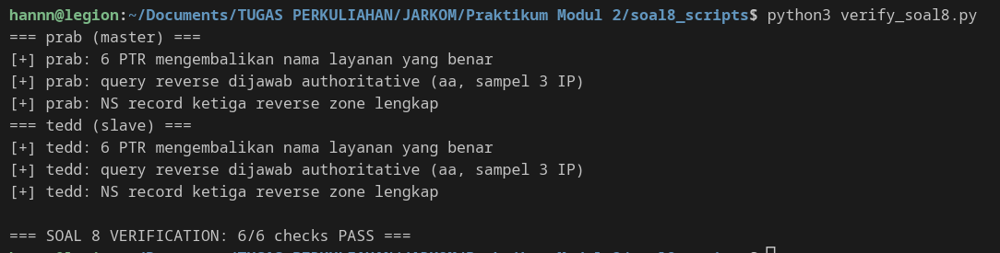

## Soal 9

> Jalankan layanan web statis pada hostname di node area vault (menggunakan apache). Buka folder direktori /arsip/ dan aktifkan fitur autoindex (directory listing) pada konfigurasi Nginx sehingga seluruh daftar file di dalamnya dapat ditelusuri langsung dari browser. Akses pengujian harus dilakukan melalui hostname, bukan IP address.

---

### Konfigurasi

Web statis area vault dijalankan dengan **Apache2** pada obladi dan desmond, sesuai penegasan "(menggunakan apache)" pada soal. Fitur autoindex yang dimaksud diaktifkan melalui `mod_autoindex` milik Apache. Apache2 diinstal idempotent melalui blok baru `init_obladi.sh` dan `init_desmond.sh` (bagian dari `/root/init.sh`, jadi service kembali aktif otomatis saat boot).

Direktori `/var/www/html/arsip/` disiapkan berisi tiga dokumen .txt, dan fitur directory listing diaktifkan lewat konfigurasi tersendiri (`/etc/apache2/conf-available/autoindex-arsip.conf`, di-enable dengan `a2enconf`) - `mod_autoindex` Apache:

```sh
# 6. web statis apache (soal 9)
if ! command -v apache2 >/dev/null 2>&1; then
    log "installing apache2 (menunggu koneksi internet untuk apt) ..."
    W=0
    until ping -c1 -W2 8.8.8.8 >/dev/null 2>&1 || [ $W -ge 24 ]; do
        sleep 5
        W=$((W+1))
    done
    apt-get update -qq
    DEBIAN_FRONTEND=noninteractive apt-get install -y -qq apache2
fi
mkdir -p /var/www/html/arsip
for F in dokumen-1.txt dokumen-2.txt dokumen-3.txt; do
    if [ ! -f /var/www/html/arsip/$F ]; then
        echo "dokumen sindikat: $F" > /var/www/html/arsip/$F
    fi
done

cat > /etc/apache2/conf-available/autoindex-arsip.conf <<'CONF'
ServerName obladi.k13.com

<Directory /var/www/html/arsip>
    Options +Indexes
    AllowOverride None
    Require all granted
</Directory>
CONF
```

lalu dienable dan service dijalankan (tanpa systemd, dengan wait loop pid):

```sh
a2enconf autoindex-arsip >/dev/null 2>&1 || true
a2enmod autoindex >/dev/null 2>&1 || true
apache2ctl configtest >/dev/null 2>&1 || true
apache2ctl stop >/dev/null 2>&1 || true
apache2ctl start
N=0
until pidof apache2 >/dev/null 2>&1 || [ $N -ge 10 ]; do
    sleep 1
    N=$((N+1))
done
```

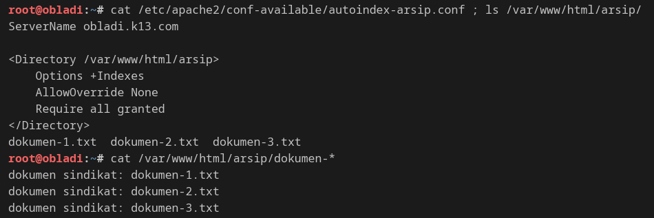

Sebagai dukungan pengujian, `curl` juga dipasang pada seluruh host melalui blok baru init script (dipakai sejak soal ini untuk semua pengujian HTTP).

### Verifikasi

Listing directory diakses **melalui hostname** (bukan IP): `curl http://obladi.k13.com/arsip/` dari alpha menampilkan daftar seluruh file di /arsip/ secara otomatis - inilah bukti autoindex:

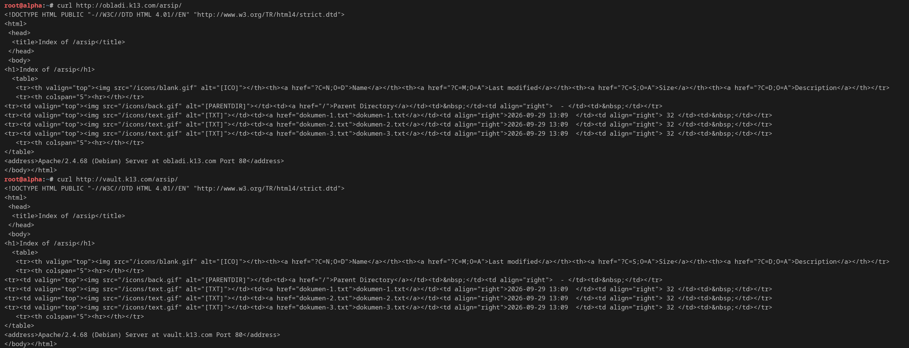

Verifikasi otomatis (kode lengkap pada `assets/verify_soal9.py`) memeriksa: apache2 running pada kedua vault node, autoindex menampilkan 3 dokumen (server-local), dan akses HTTP 200 via hostname dari dua klien berbeda - `obladi.k13.com`, `vault.k13.com`, dan `desmond.k13.com`:

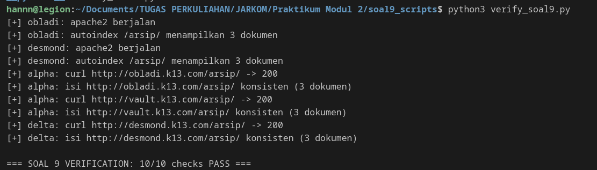

## Soal 10

> Jalankan layanan web dinamis (PHP-FPM) pada hostname di node core (menggunakan nginx). Buat sebuah aplikasi sederhana yang memuat halaman beranda dan halaman profil. Terapkan aturan rewrite pada server sehingga akses ke /profil dapat berfungsi dengan URL bersih (tanpa akhiran .php). Akses pengujian wajib dilakukan melalui hostname.

---

### Konfigurasi

Web dinamis area core dijalankan dengan **Nginx + PHP-FPM (php8.4-fpm)** pada oblada dan molly, diinstal idempotent melalui blok baru `init_oblada.sh` dan `init_molly.sh` (bagian `/root/init.sh`, aktif kembali otomatis saat boot). Aplikasi sederhana disimpan pada `/var/www/beranda/`: `index.php` (halaman beranda) dan `profil.php` (halaman profil), keduanya mencetak versi PHP dan hostname backend sehingga eksekusi PHP-FPM terbukti (bukan sekadar serve file statis).

Snippet `/root/init.sh` pada `init_oblada.sh` (pola sama di `init_molly.sh`):

```sh
# 6. web dinamis nginx (soal 10)
if ! [ -x /usr/sbin/php-fpm8.4 ] || ! command -v nginx >/dev/null 2>&1; then
    log "installing nginx + php8.4-fpm (menunggu koneksi internet untuk apt) ..."
    W=0
    until ping -c1 -W2 8.8.8.8 >/dev/null 2>&1 || [ $W -ge 24 ]; do
        sleep 5
        W=$((W+1))
    done
    apt-get update -qq
    DEBIAN_FRONTEND=noninteractive apt-get install -y -qq nginx php8.4-fpm
fi
mkdir -p /var/www/beranda
cat > /var/www/beranda/index.php <<'PHP'
<?php
echo "BERANDA The Mesh - PHP aktif: " . PHP_VERSION . " di " . gethostname();
PHP
cat > /var/www/beranda/profil.php <<'PHP'
<?php
echo "PROFIL The Mesh - URL: " . htmlspecialchars($_SERVER['REQUEST_URI']);
echo " | PHP " . PHP_VERSION . " di " . gethostname();
PHP
cat > /etc/nginx/sites-available/beranda <<'CONF'
server {
    listen 80 default_server;
    server_name _;
    root /var/www/beranda;
    index index.php index.html;

    location / {
        try_files $uri $uri/ $uri.php$is_args$args;
    }

    location ~ \.php$ {
        include snippets/fastcgi-php.conf;
        fastcgi_pass unix:/run/php/php8.4-fpm.sock;
    }
}
CONF
rm -f /etc/nginx/sites-enabled/default
ln -sf /etc/nginx/sites-available/beranda /etc/nginx/sites-enabled/beranda
service php8.4-fpm restart >/dev/null 2>&1 || /usr/sbin/php-fpm8.4 --daemonize
nginx -t >/dev/null 2>&1 || true
nginx -s quit 2>/dev/null || true
sleep 1
nginx
N=0
until curl -s -o /dev/null http://127.0.0.1/ || [ $N -ge 10 ]; do
    sleep 1
    N=$((N+1))
done
```

Aturan rewrite intinya ada pada `try_files $uri $uri/ $uri.php$is_args$args` - permintaan `/profil` tidak menemukan file `profil`, lalu jatuh ke `profil.php` secara internal sehingga URL tetap bersih (tanpa `.php`) di address bar. Handler `~ \.php$` meneruskan eksekusi ke PHP-FPM lewat unix socket `/run/php/php8.4-fpm.sock`.

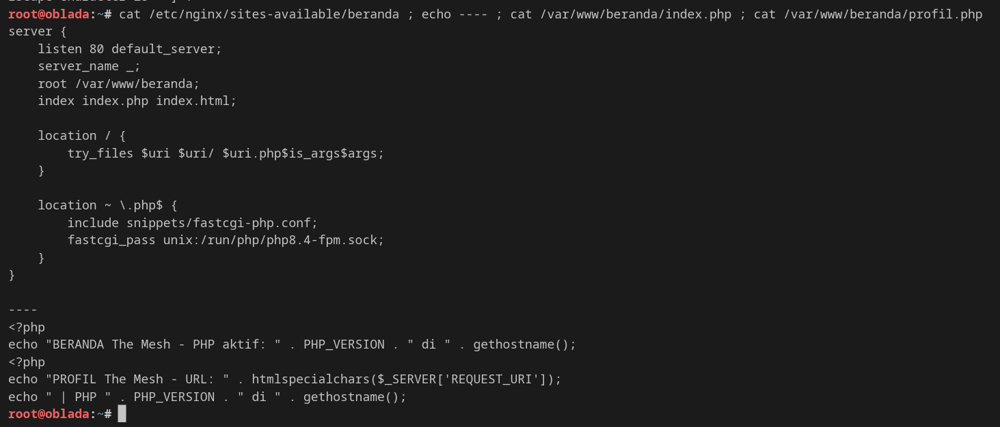

### Verifikasi

Halaman beranda dan profil diakses **melalui hostname** (bukan IP) - `curl http://core.k13.com/profil` dari alpha menampilkan ap profil yang ter-render PHP:

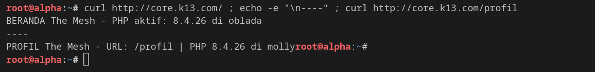

Verifikasi otomatis (kode lengkap pada `assets/verify_soal10.py`) memeriksa: nginx+php-fpm berjalan di kedua node, halaman ter-render (tanpa source dump `<?php`), `/profil` bersih dan `/profil.php` langsung tetap 200, akses via hostname dari dua klien (`core.k13.com`, `oblada.k13.com`, `molly.k13.com`), dan round-robin DNS `core` menyentuh kedua backend:

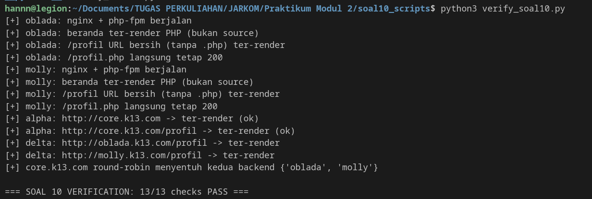

## Soal 11

> Konfigurasikan Penny (menggunakan Apache) sebagai reverse proxy yang mengarah ke semua node di area vault (Obladi & Desmond). Sementara itu, konfigurasikan Abbey (menggunakan Nginx) sebagai reverse proxy menuju area core (Oblada & Molly). Pastikan kedua gerbang ini meneruskan identitas asli pengunjung ke server backend dengan melakukan forwarding header Host dan X-Real-IP. Buktikan bahwa Penny dan Abbey berhasil mendistribusikan lalu lintas dengan tepat.

---

### Konfigurasi

Kedua gerbang dipasang sebagai reverse proxy dengan load balancing dua backend (sesuai mapping pada soal: **penny → area vault**, **abbey → area core**; jalur kanoniknya `www` → penny dan `static` → abbey dari Soal 7). Untuk membuktikan distribusi, setiap backend vault diberi file penanda di `/arsip/` (`backend-obladi.txt` / `backend-desmond.txt`), sementara halaman core sudah mencetak `gethostname()` ditambah header `Host` dan `X-Real-IP` yang diterima backend.

Snippet `/root/init.sh` pada `init_penny.sh` - Apache dengan `mod_proxy_balancer` (round-robin), `ProxyPreserveHost` untuk meneruskan Host asli, dan `RequestHeader` untuk menyuntikkan `X-Real-IP` berisi IP pengunjung:

```sh
# 6. reverse proxy apache (soal 11)
if ! command -v apache2 >/dev/null 2>&1; then
    log "installing apache2 (menunggu koneksi internet untuk apt) ..."
    W=0
    until ping -c1 -W2 8.8.8.8 >/dev/null 2>&1 || [ $W -ge 24 ]; do
        sleep 5
        W=$((W+1))
    done
    apt-get update -qq
    DEBIAN_FRONTEND=noninteractive apt-get install -y -qq apache2
fi
cat > /etc/apache2/conf-available/servername.conf <<'CONF'
ServerName www.k13.com
CONF
a2enconf servername >/dev/null 2>&1 || true
a2enmod proxy proxy_http proxy_balancer lbmethod_byrequests headers >/dev/null 2>&1
cat > /etc/apache2/sites-available/gate-proxy.conf <<'CONF'
<VirtualHost *:80>
    ServerName www.k13.com

    ProxyPreserveHost On
    RequestHeader set X-Real-IP "expr=%{REMOTE_ADDR}"

    <Proxy balancer://vault>
        BalancerMember http://10.70.1.4
        BalancerMember http://10.70.1.5
    </Proxy>
    ProxyPass / balancer://vault/
    ProxyPassReverse / balancer://vault/
</VirtualHost>
CONF
a2dissite 000-default >/dev/null 2>&1
a2ensite gate-proxy >/dev/null 2>&1
apache2ctl configtest >/dev/null 2>&1 || true
apache2ctl stop >/dev/null 2>&1 || true
apache2ctl start
N=0
until pidof apache2 >/dev/null 2>&1 || [ $N -ge 10 ]; do
    sleep 1
    N=$((N+1))
done
log "apache reverse proxy aktif - balancer vault: $(curl -s -o /dev/null -w '%{http_code}' http://127.0.0.1/arsip/)"
```

Snippet `init_abbey.sh` - Nginx dengan blok `upstream` (round-robin default) dan `proxy_set_header` untuk meneruskan identitas:

```sh
# 6. reverse proxy nginx (soal 11)
if ! command -v nginx >/dev/null 2>&1; then
    log "installing nginx (menunggu koneksi internet untuk apt) ..."
    W=0
    until ping -c1 -W2 8.8.8.8 >/dev/null 2>&1 || [ $W -ge 24 ]; do
        sleep 5
        W=$((W+1))
    done
    apt-get update -qq
    DEBIAN_FRONTEND=noninteractive apt-get install -y -qq nginx
fi
cat > /etc/nginx/sites-available/core-proxy <<'CONF'
upstream core_backends {
    server 10.70.1.6;
    server 10.70.1.7;
}
server {
    listen 80 default_server;
    server_name _;

    location / {
        proxy_pass http://core_backends;
        proxy_set_header Host $host;
        proxy_set_header X-Real-IP $remote_addr;
    }
}
CONF
rm -f /etc/nginx/sites-enabled/default
ln -sf /etc/nginx/sites-available/core-proxy /etc/nginx/sites-enabled/core-proxy
nginx -t >/dev/null 2>&1 || true
nginx -s quit 2>/dev/null || true
sleep 1
nginx
N=0
until curl -s -o /dev/null http://127.0.0.1/ || [ $N -ge 10 ]; do
    sleep 1
    N=$((N+1))
done
log "nginx reverse proxy aktif - upstream core: $(curl -s -o /dev/null -w '%{http_code}' http://127.0.0.1/)"
```

Snippet pendukung bukti distribusi - file penanda backend di `arsip` telnet (`init_obladi.sh`/`init_desmond.sh`, bagian Soal 9 yang diperluas di soal ini):

```sh
if [ ! -f /var/www/html/arsip/backend-obladi.txt ]; then
    echo "backend: obladi" > /var/www/html/arsip/backend-obladi.txt
fi
```

Halaman beranda core juga diperluas untuk mencetak header yang diterima - sehingga penerusan identitas langsung terlihat dari isi halaman:

```php
<?php
echo "BERANDA The Mesh - PHP " . PHP_VERSION . " di " . gethostname();
echo " | Host: " . ($_SERVER['HTTP_HOST'] ?? '-');
echo " | X-Real-IP: " . ($_SERVER['HTTP_X_REAL_IP'] ?? '-');
```

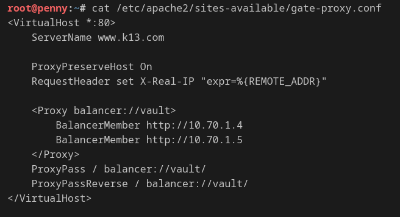

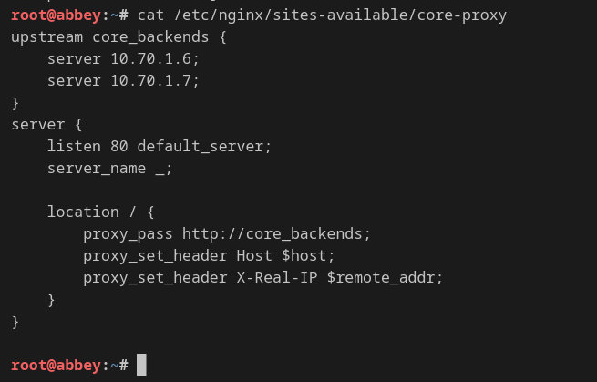

### Verifikasi

Distribusi lalu lintas terbukti dari pergantian backend yang muncul antar request - `curl http://www.k13.com/arsip/` dari alpha berkali-kali menampilkan `backend-obladi.txt` dan `backend-desmond.txt` secara bergantian (round-robin balancer penny), dan `curl http://static.k13.com/` bergantian antara `di oblada` dan `di molly` (upstream abbey). Penerusan identitas terlihat dari isi halaman core: lewat gerbang, halaman menampilkan `Host: static.k13.com` dan `X-Real-IP: 10.70.2.2` (IP asli alpha); akses langsung ke backend menampilkan `X-Real-IP: -` sebagai pembanding:

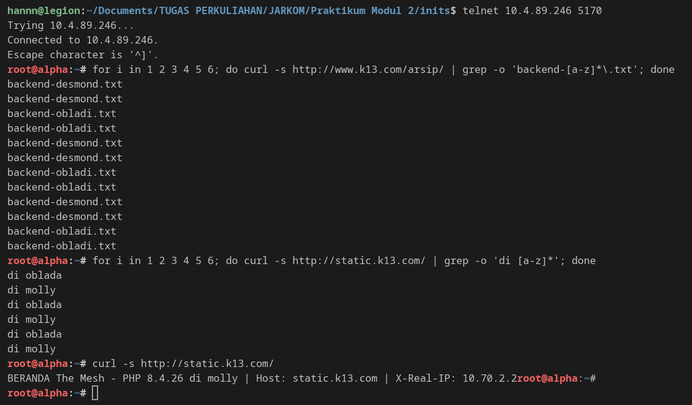

Catatan operasional yang memperkuat klaim ketahanan: sewaktu kontainer oblada sempat terdeteksi tidak bisa dihubungi dari jaringan (service lokal masih sehat - `curl http://127.0.0.1/` bergerak normal - namun trafik dari abbey/delta tidak sampai), kontainer direstart via GNS3; saat boot `/root/init.sh` otomatis menginstal ulang nginx + php8.4-fpm (paket tidak persisten saat restart) dan mengembalikan seluruh konfigurasi, sehingga seluruh pemeriksaan soal 11 lulus kembali tanpa konfigurasi manual.

Verifikasi otomatis (kode lengkap pada `assets/verify_soal11.py`) memeriksa: kedua gerbang berjalan, distribusi 2-backend dari sisi gerbang maupun klien melalui hostname kanonik, penerusan X-Real-IP dari dua klien segmen berbeda, penerusan Host, dan kontras akses langsung:

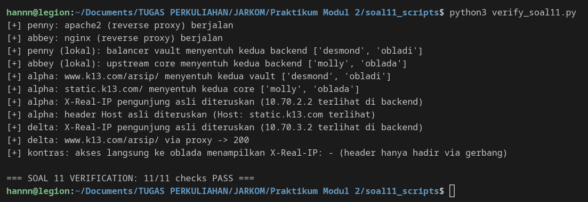

## Soal 12

> Terdapat ruang khusus di penny yang menyimpan dokumen rahasia sindikat, oleh karena itu terapkan perlindungan basic authentication untuk path /admin. Akses ke jalur tersebut harus menolak pengunjung tanpa kredensial, dan hanya mengizinkan masuk jika menggunakan credential berikut:

| username | password |
|---|---|
| **prabs** | **pakar_pinter_jadi_gob\*\*\*** |

---

### Konfigurasi

Konfigurasi ditambahkan pada vhost gerbang penny (`/etc/apache2/sites-available/gate-proxy.conf`, dikelola `init_penny.sh`). Karena penny adalah reverse proxy yang melempar seluruh `/` ke balancer vault, path `/admin` **harus dikecualikan dari proxy** (`ProxyPass /admin !`) dan disajikan dari direktori lokal penny (`/var/www/admin`) berisi halaman dokumen rahasia, lalu dilindungi basic auth berbasis `.htpasswd` (bcrypt, dibuat dengan `htpasswd -cbB`).

Password tersensor pada soal (`pakar_pinter_jadi_gob***`) dilengkapi oleh petunjuk gambar penutup dokumen soal (caption "Pakar Saking Pinternya Jadi Gob…"), sehingga dipakai `pakar_pinter_jadi_goblok` - dan sudah dikonfirmasi kepada asisten.

```sh
# 7. basic auth /admin (soal 12)
htpasswd -cbB /etc/apache2/.htpasswd prabs 'pakar_pinter_jadi_goblok'
```

Snippet vhost (bagian yang berubah dari Soal 11):

```sh
ProxyPass /admin !

Alias /admin /var/www/admin
<Directory /var/www/admin>
    Options Indexes
    AllowOverride None
    AuthType Basic
    AuthName "Area Rahasia Sindikat"
    AuthUserFile /etc/apache2/.htpasswd
    Require valid-user
</Directory>
```

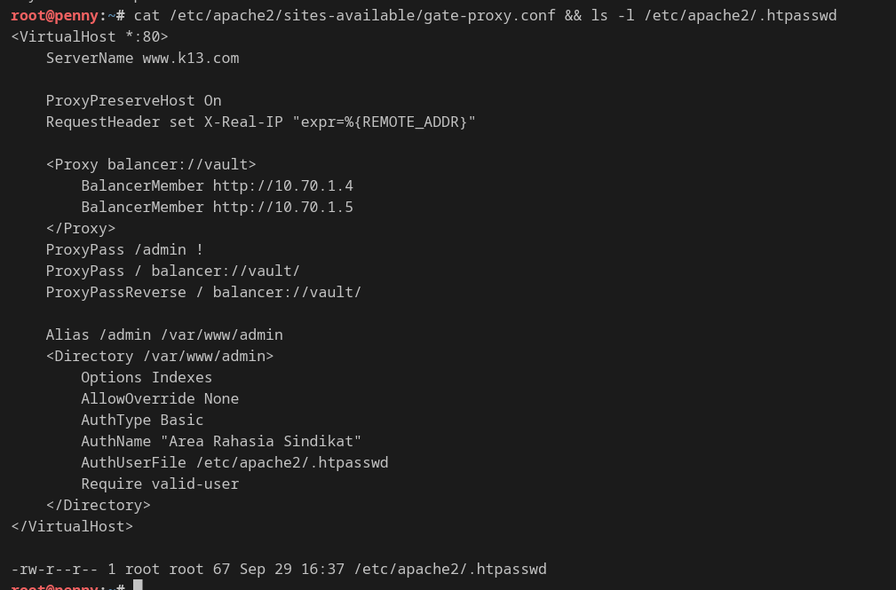

### Verifikasi

Dari klien, akses tanpa kredensial ditolak `401` dengan header `WWW-Authenticate: Basic realm="Area Rahasia Sindikat"`, akses dengan kredensial `prabs` membuka halaman `200`, dan kredensial salah kembali ditolak - sementara jalur proxy lain (`/arsip/`) tetap terbuka tanpa auth:

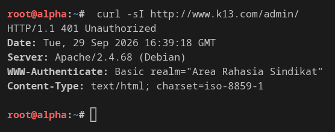

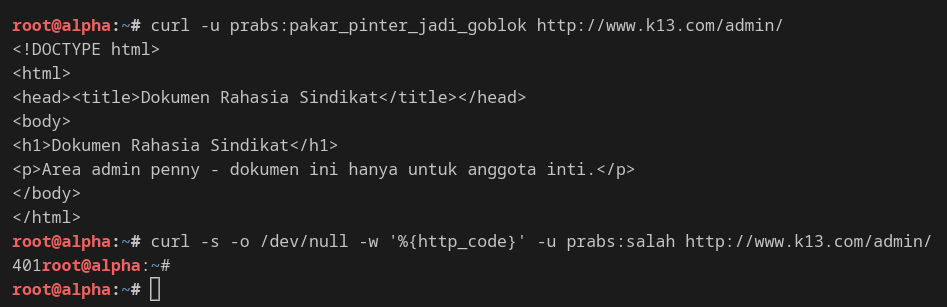

Verifikasi otomatis (kode lengkap pada `assets/verify_soal12.py`) memeriksa semuanya di penny, dari dua klien berbeda (`www.k13.com` dan `penny.k13.com`), termasuk regresi jalur proxy:

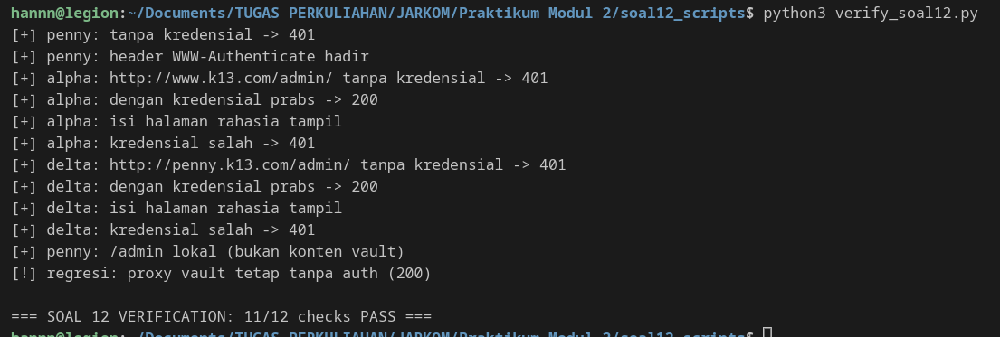


## Soal 13 
Akses lewat IP atau domain penny di-redirect permanen (301) ke www.k13.com. Akses lewat IP atau domain abbey di-redirect sementara (302) ke static.k13.com. www dan static sendiri tidak boleh ikut ter-redirect.
### Konfigurasi

Penny memakai Apache. Vhost redirect penny-redirect.conf dipasang di samping gate-proxy.conf. Apache memilih vhost dari ServerName dan ServerAlias, sehingga www.k13.com tetap dilayani gate-proxy.

<<<<<<< HEAD


### Verifikasi


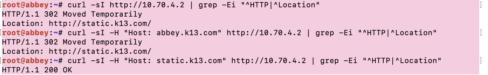


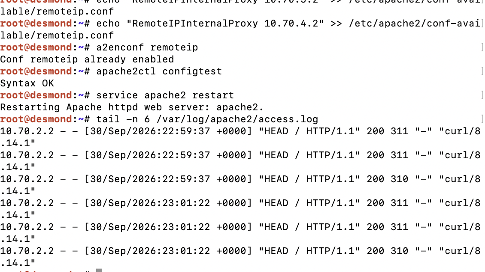
=======
`cat /etc/apache2/sites-available/penny-redirect.conf`
<VirtualHost *:80>
    ServerName penny.k13.com
    ServerAlias 10.70.5.2
    Redirect permanent / http://www.k13.com/
</VirtualHost>

`apache2ctl -S`
VirtualHost configuration:
*:80                   is a NameVirtualHost
         default server www.k13.com (/etc/apache2/sites-enabled/gate-proxy.conf:1)
         port 80 namevhost www.k13.com (/etc/apache2/sites-enabled/gate-proxy.conf:1)
         port 80 namevhost penny.k13.com (/etc/apache2/sites-enabled/penny-redirect.conf:1)
                 alias 10.70.5.2
ServerRoot: "/etc/apache2"
Main DocumentRoot: "/var/www/html"
Main ErrorLog: "/var/log/apache2/error.log"
Mutex mpm-accept: using_defaults
Mutex watchdog-callback: using_defaults
Mutex proxy-balancer-shm: using_defaults
Mutex proxy: using_defaults
Mutex default: dir="/var/run/apache2/" mechanism=default 
PidFile: "/var/run/apache2/apache2.pid"
Define: DUMP_VHOSTS
Define: DUMP_RUN_CFG
User: name="www-data" id=33
Group: name="www-data" id=33

`cat /etc/nginx/sites-available/redirect`
server {
    listen 80;
    server_name 10.70.4.2 abbey.k13.com;
    return 302 `http://static.k13.com$request_uri`;
}


### Verifikasi


>>>>>>> d8c5deb (revisi)


## Soal 14 
Access log setiap server web di area vault dan core harus mencatat IP asli client yang diteruskan gerbang, bukan IP penny atau abbey.

## Konfigurasi 

Agar access log backend mencatat IP asli client, gerbang meneruskan IP asli lewat header `X-Forwarded-For`, dan backend hanya memercayai header itu bila datang dari IP gerbang (supaya tidak bisa dipalsukan client).
Penny tidak perlu diubah karena ProxyPass pada Apache sudah menambahkan `X-Forwarded-For otomatis`. Pada abbey ditambahkan satu baris pada location / di `core-proxy` (juga di heredoc `init_abbey.sh`)
<<<<<<< HEAD
sh
`proxy_set_header` `X-Forwarded-For` `$proxy_add_x_forwarded_for;`

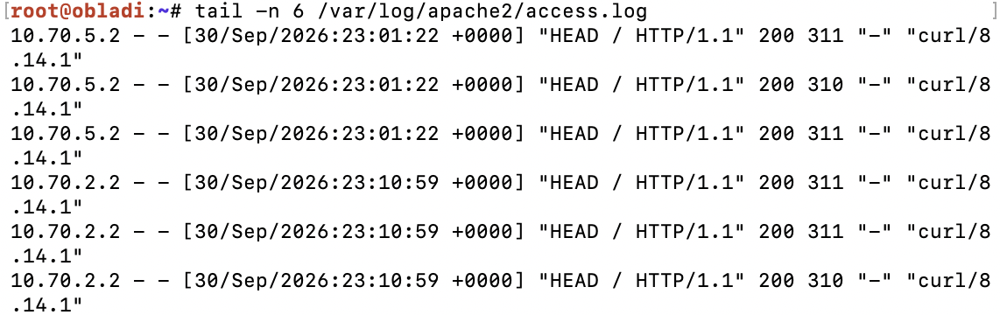 //obladi
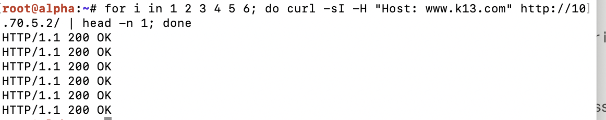 // alpha


## Verifikasi 


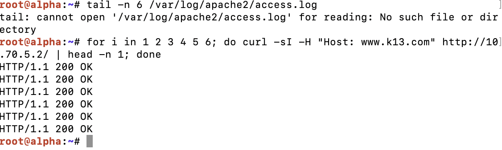
=======
abbey
`grep -n "X-Forwarded-For" /etc/nginx/sites-available/core-proxy`
sh
`proxy_set_header` `X-Forwarded-For` `$proxy_add_x_forwarded_for;`
obladi dan desmond
`a2enmod remoteip`
`echo "RemoteIPHeader X-Forwarded-For" > /etc/apache2/conf-available/remoteip.conf`
`echo "RemoteIPInternalProxy 10.70.5.2" >> /etc/apache2/conf-available/remoteip.conf`
`echo "RemoteIPInternalProxy 10.70.4.2" >> /etc/apache2/conf-available/remoteip.conf`
`a2enconf remoteip`
`apache2ctl configtest`
`service apache2 restart`
oblada dan molly 
`echo "set_real_ip_from 10.70.4.2;" > /etc/nginx/conf.d/realip.conf`
`echo "real_ip_header X-Forwarded-For;" >> /etc/nginx/conf.d/realip.conf`
`nginx -t`
`nginx -s reload`


## Verifikasi 


>>>>>>> d8c5deb (revisi)

## Soal 15 
Rootkit menginstruksikan pembuatan jalur proxy khusus yang berdiri sendiri. Di penny buat reverse proxy untuk path `/eternal` yang menyajikan `/var/www/eternal` dan dapat mengeksekusi PHP. Di abbey buat jalur `/orion` yang menyajikan `/var/www/orion` secara statis tanpa rendering PHP.

## Konfigurasi 
`/eternal` dikecualikan dari balancer vault (`ProxyPass /eternal !`) dan dilayani langsung oleh penny dengan `mod_php`. `/orion` dilayani langsung oleh abbey dengan alias, tanpa handler PHP, sehingga file .php hanya terkirim sebagai teks.

<<<<<<< HEAD
## Verifikasi 
=======
penny
`apt install libapache2-mod-php -y`
`mkdir -p /var/www/eternal`
`echo '<?php echo "Eternal PHP aktif, versi " . phpversion(); ?>' > /var/www/eternal/index.php`
`chown -R www-data:www-data /var/www/eternal`
`echo 'ProxyPass /eternal !' > /etc/apache2/eternal-path.conf`
`echo 'Alias /eternal /var/www/eternal' >> /etc/apache2/eternal-path.conf`
`echo '<Directory /var/www/eternal>' >> /etc/apache2/eternal-path.conf`
`echo '    DirectoryIndex index.php index.html' >> /etc/apache2/eternal-path.conf`
`echo '    Options -Indexes' >> /etc/apache2/eternal-path.conf`
`echo '    AllowOverride None' >> /etc/apache2/eternal-path.conf`
`echo '    Require all granted' >> /etc/apache2/eternal-path.conf`
`echo '</Directory>' >> /etc/apache2/eternal-path.conf`
`grep -c "eternal-path" /etc/apache2/sites-available/gate-proxy.conf`

abbey 
`mkdir -p /var/www/orion`
`echo '<h1>Orion statis</h1>' > /var/www/orion/index.html`
`echo '<?php echo "PHP dijalankan"; ?>' > /var/www/orion/tes.php`
`chmod -R 755 /var/www/orion`
`echo 'location /orion {' > /etc/nginx/orion-location.conf`
`echo '    alias /var/www/orion;' >> /etc/nginx/orion-location.conf`
`echo '    index index.html;' >> /etc/nginx/orion-location.conf`
`echo '}' >> /etc/nginx/orion-location.conf`
`grep -c "orion-location" /etc/nginx/sites-available/core-proxy`


## Verifikasi 


>>>>>>> d8c5deb (revisi)


## Soal 16 
Dari satu klien (alpha), jalankan stress test ApacheBench 250 request dengan konkurensi 10 ke `www.k13.com` dan `static.k13.com`

## Konfigurasi 
<<<<<<< HEAD

Tidak ada konfigurasi server. Alpha hanya membutuhkan ab (paket apache2-utils) dan dig, yang dipasang otomatis lewat `init_alpha.sh`:

`command -v ab >/dev/null 2>&1 || (apt-get update -qq && DEBIAN_FRONTEND=noninteractive apt-get install -y -qq apache2-utils)`

`command -v dig >/dev/null 2>&1 || (apt-get update -qq && DEBIAN_FRONTEND=noninteractive apt-get install -y -qq bind9-dnsutils)`
=======
alpha 
`apt install apache2-utils -y`
`ab -V`

`grep -c "apache2-utils" /root/init.sh`
>>>>>>> d8c5deb (revisi)

## Verifikasi 
Jalankan saat abbey berada di `10.70.4.2`, karena `static.k13.com` adalah `CNAME` ke abbey. Catatan untuk laporan: Failed requests pada `static.k13.com` bertipe Length, bukan error koneksi. Dua core (oblada dan molly) memberi halaman dengan panjang berbeda, dan ab menghitung selisih panjang sebagai gagal. Opsi -l menerima panjang yang bervariasi.

<<<<<<< HEAD
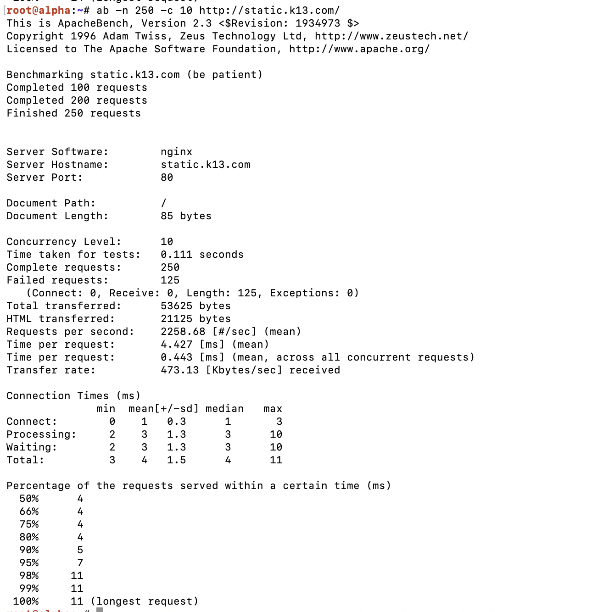 // yang kedua 
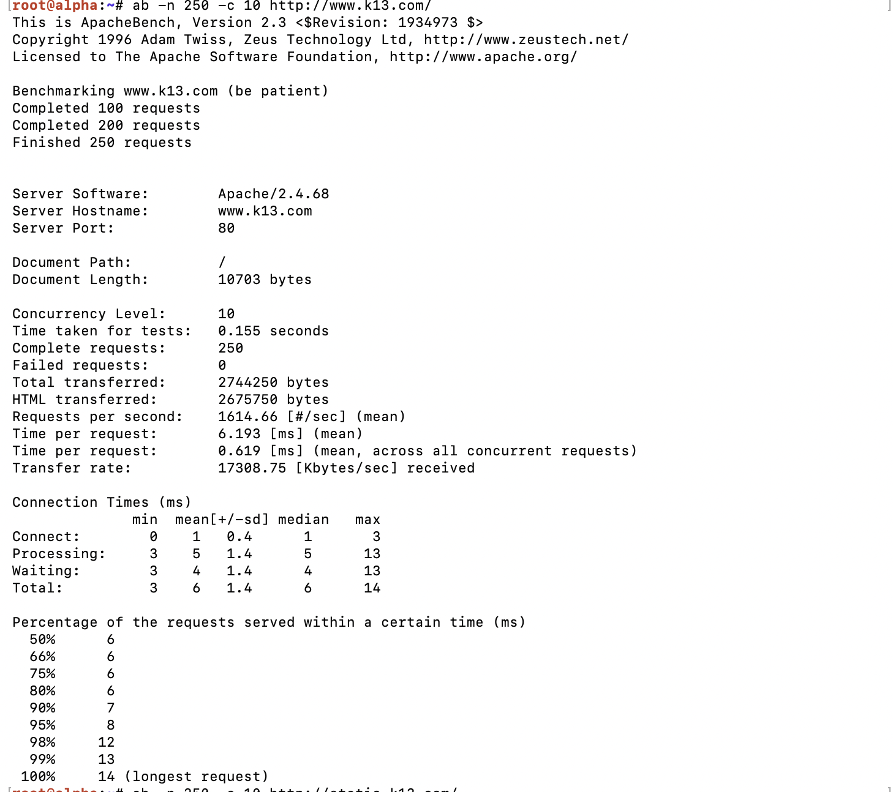 //yang pertama
=======


>>>>>>> d8c5deb (revisi)


## Soal 17
Tambahkan TXT record pada DNS untuk semua klien (alpha, beta, gamma, delta, epsilon). Query TXT ke nama domain mereka mengembalikan hostname masing-masing.

## Konfigurasi 
Lima baris TXT ditambahkan di dalam heredoc zona db.k13.com pada `init_prab.sh`, tepat di bawah A record epsilon. Serial tidak diubah manual karena dihitung otomatis dari date ($SERIAL), sehingga tedd ikut menarik zona baru.

`alpha    IN TXT "alpha"`
`beta     IN TXT "beta"`
`gamma    IN TXT "gamma"`
`delta    IN TXT "delta"`
`epsilon  IN TXT "epsilon"`

<<<<<<< HEAD
## Verifikasi 


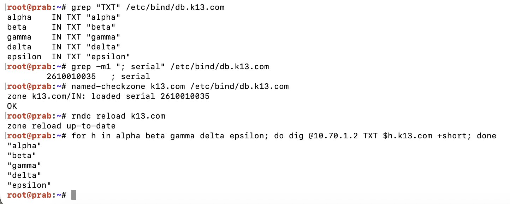 //prab
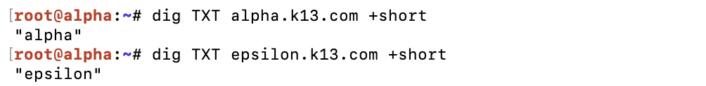 //alpha
=======

`SER=$(grep -m1 "; serial" /etc/bind/db.k13.com | awk '{print $1}')`
`sed -i "s/$SER/$((SER+1))/" /etc/bind/db.k13.com`
`for h in alpha beta gamma delta epsilon; do echo "$h IN TXT \"$h\"" >> /etc/bind/db.k13.com; done`
`named-checkzone k13.com /etc/bind/db.k13.com`
`rndc reload k13.com`


## Verifikasi 


>>>>>>> d8c5deb (revisi)


## Soal 18
Ubah A record `abbey.k13.com` ke IP fiktif acak yang valid. Naikkan serial SOA di prab dan pastikan tedd tersinkron. Set TTL 15 detik. Verifikasi tiga fase: sebelum perubahan (IP lama), baru berubah dalam 15 detik (masih IP lama karena cache), setelah TTL habis (IP baru).

## Konfigurasi 
TTL 15 dipasang permanen di heredoc zona `init_prab.sh`:
`abbey 15 IN A 10.70.4.2`
Prab dan tedd menjawab langsung dari zona tanpa cache, jadi fase 2 diperagakan memakai resolver cache dnsmasq di alpha (port 5353) yang meneruskan ke prab. Ini pendekatan pembuktian, bukan konfigurasi layanan produksi.

## Verifikasi 
<<<<<<< HEAD
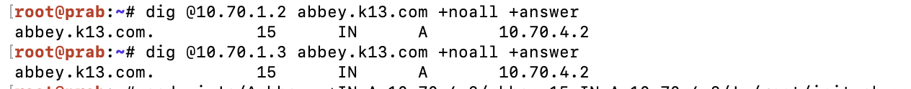 //dig
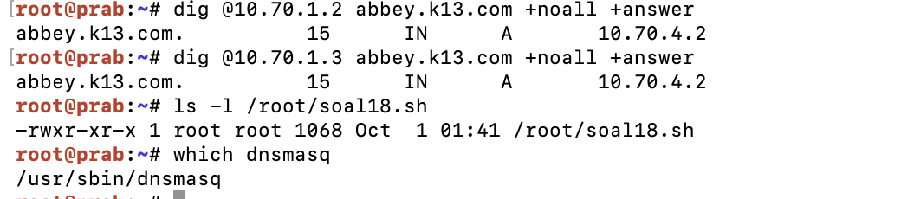// dig
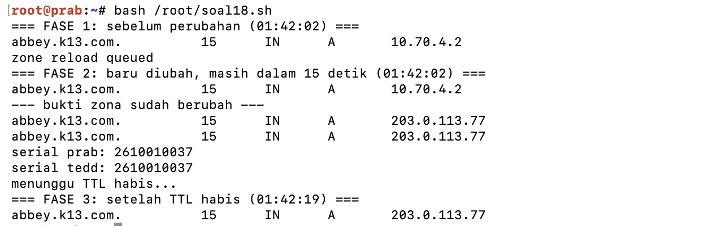 //bash 

=======
kosong karena nomor 18 belum bisa menyesuaikan timingnya, namun bisa jalan. 
>>>>>>> d8c5deb (revisi)


## Soal 19 
Buat CNAME `outbound.k13.com` menuju domain eksternal `http.badssl.com`. Jalankan curl ke `http://outbound.k13.com` dan pastikan output sesuai isi halaman `http.badssl.com`.

## Konfigurasi 
Satu baris CNAME di heredoc zona `init_prab.sh`, tepat di bawah baris static. Titik di akhir nama wajib agar bind tidak menambahkan `.k13.com`:
`outbound IN CNAME http.badssl.com`

<<<<<<< HEAD
Prab me-resolve nama eksternal lewat forwarder `192.168.122.1.`
=======
`SER=$(grep -m1 "; serial" /etc/bind/db.k13.com | awk '{print $1}')`
`sed -i "s/$SER/$((SER+1))/" /etc/bind/db.k13.com`
`echo "outbound IN CNAME http.badssl.com." >> /etc/bind/db.k13.com`
`named-checkzone k13.com /etc/bind/db.k13.com`
`rndc reload k13.com`
`Prab me-resolve nama eksternal lewat forwarder 192.168.122.1`


>>>>>>> d8c5deb (revisi)

## Verifikasi 
Catatan untuk laporan: CNAME hanya mengarahkan IP tujuan. Server badssl memilih halaman berdasarkan header Host, sehingga curl polos ke `outbound.k13.com` menampilkan halaman default nginx. Karena itu header Host: http.badssl.com diberikan eksplisit, dan isinya sama persis (diff mencetak SAMA).

<<<<<<< HEAD
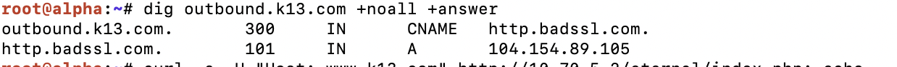
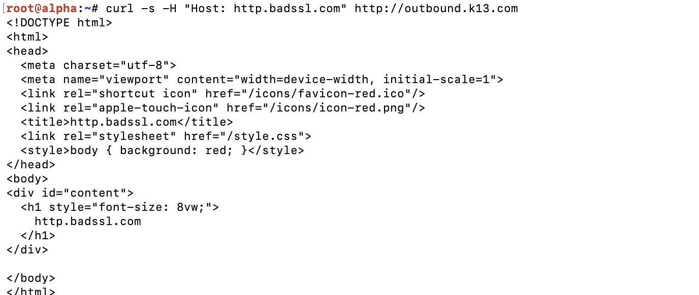
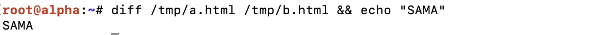
=======

>>>>>>> d8c5deb (revisi)


## Soal 20 
Setelah semua selesai, pastikan semua service dan konfigurasi yang dikerjakan tetap berjalan normal dan autostart saat node di-restart. Khusus kasus ini, abaikan konfigurasi nomor 18 dan biarkan koordinat kembali normal.

## Konfigurasi 
Tidak ada konfigurasi baru. Autostart dipenuhi karena semua konfigurasi nomor 13 sampai 19 berada di `/root/init.sh` tiap node, yang dijalankan otomatis oleh debinet saat boot (Soal 1). Untuk bagian "koordinat kembali normal", record abbey dikembalikan ke `10.70.4.2` (`bash /root/soal18.sh reset`).

## Verifikasi 
Di GNS3, Stop lalu Start node (NAT dan rootkit dulu, lalu prab dan tedd, backend, abbey dan penny, alpha). Tunggu log [init:...] selesai tanpa mengetik apa pun.

<<<<<<< HEAD


=======


>>>>>>> d8c5deb (revisi)


